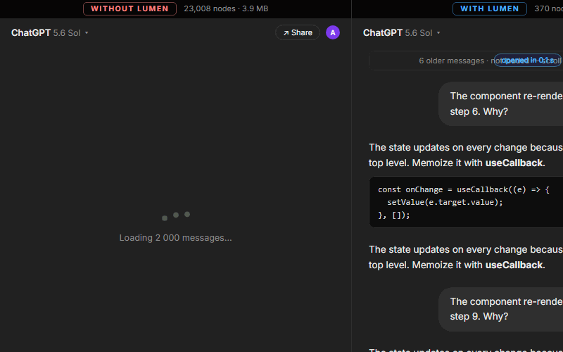

# Lumen

ChatGPT gets slow when a chat gets long. Pages take forever to load, scrolling stutters, and old messages you never look at still get downloaded every single time.

Lumen fixes that. It keeps only the last few messages loaded, so every chat feels short and fast no matter how big it is.

## What you get

- Long chats open **instantly**, even with thousands of messages
- Smooth scrolling, **always**
- **97% less data** downloaded, **62x smaller page** for your browser
- Old messages are not lost: **scroll up and they load on demand**
- Less memory and CPU use, **better battery life**
- ChatGPT's background trackers are **blocked**
- Nothing appears inside the page. No buttons, no banners

The numbers were measured on realistic conversation data, see [BENCHMARKS.md](BENCHMARKS.md).

## Install

1. Open `chrome://extensions`
2. Turn on Developer mode (top right)
3. Click Load unpacked and pick this folder

Then open ChatGPT and use it like always. **Free, no account needed.**

## Usage

Works out of the box. Scroll up in a chat to load older messages. Click the Lumen icon to change how many messages stay in view (default 10) or pause it.

## Privacy

**No account, no tracking, no external requests.** Lumen never reads, stores or sends your conversations. See [PRIVACY.md](PRIVACY.md).

Works on chatgpt.com in Chrome and Chromium-based browsers (Edge, Brave, Opera). Not affiliated with OpenAI.

## How it works

Short version: when a chat loads, Lumen trims the data before ChatGPT sees it, so only recent messages arrive. While you keep chatting it keeps the page light, and older messages are fetched only when you scroll up. ChatGPT's telemetry is blocked locally.
